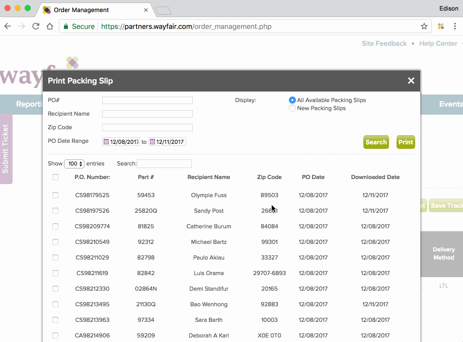

# wfExtension
https://chrome.google.com/webstore/detail/wayfair-extension/dcepkdfbjjokgechijamgcejonfnekec

## Features
* Easy-to-filter packing slips for UPS orders and LTL orders
* One click check dimension for all LTL orders
* Easy to rearrange the order of the purchasing list to match the sales list

## Usage
**Text file format**:
- purchase order column on the left
- sales order column on the right
- ex. 
 po_no | ord_no
 --- | --- 
 CS123456 | 01224 
 CA654321 | 01225 

**Check UPS purchase orders**:

- Select the demand PO date range at the order management page.
- **Change display-per-page number to the total order number** ex. if 556 totals, the display-per-page have to be 556.
- Click "Print Packing Slips" button and select the demand PO date range. (modal will popup)
- Open extension, upload the text file.
- Click the "Check UPS" button to select all UPS orders in the purchase list.

**Check LTL purchase orders**:
- Same steps as UPS mentioned above.

**Print UPS purchase list that matches the order from crystal report sale order list**
- Download UPS order excel file, copy the page order at the first row to clipboard.
- Download selected packing slips.
- Click the "Transform PDF" button, page will be directed to online2pdf.com. Drop in the packing-slip-pdf and paste the page order to the page reorder bar. Then start convert.
- Print the pdf downloaded from online2pdf.com, the order of the purchases will match the crystal report.

**Print LTL purchase list**
- Same steps as UPS mentioned above.

**Check LTL Dimension**:
- Upload text file at the order management page, to reduce the loading time, prefer filter delivery method of all orders before text file uploading.
- Click the "Check Dimension" button to select and auto-correct all item's dimension.

## License

    Copyright [2017] [Edison Huang]

    Licensed under the Apache License, Version 2.0 (the "License");
    you may not use this file except in compliance with the License.
    You may obtain a copy of the License at

        http://www.apache.org/licenses/LICENSE-2.0

    Unless required by applicable law or agreed to in writing, software
    distributed under the License is distributed on an "AS IS" BASIS,
    WITHOUT WARRANTIES OR CONDITIONS OF ANY KIND, either express or implied.
    See the License for the specific language governing permissions and
    limitations under the License.

